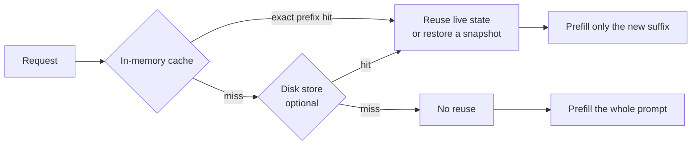
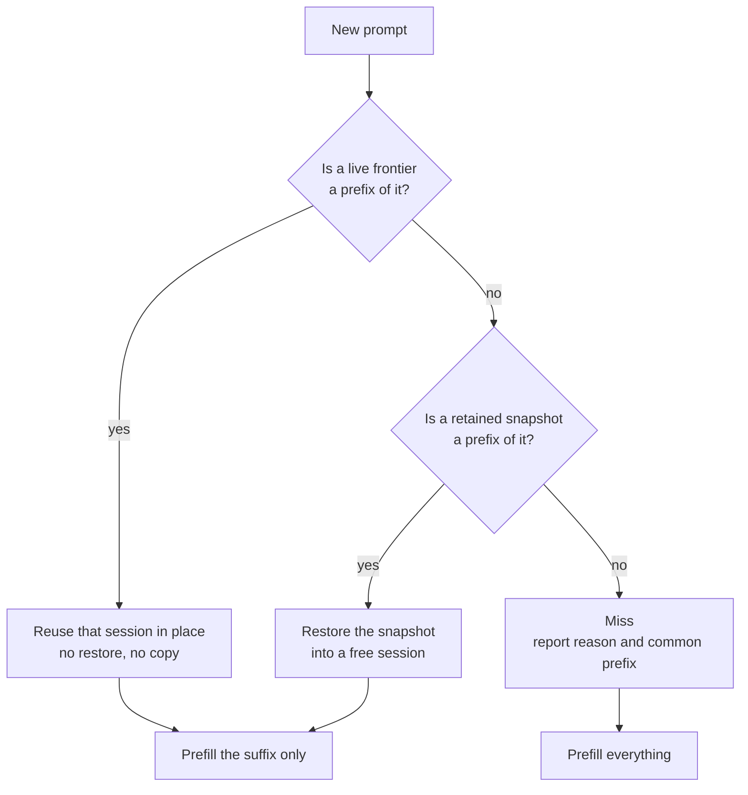
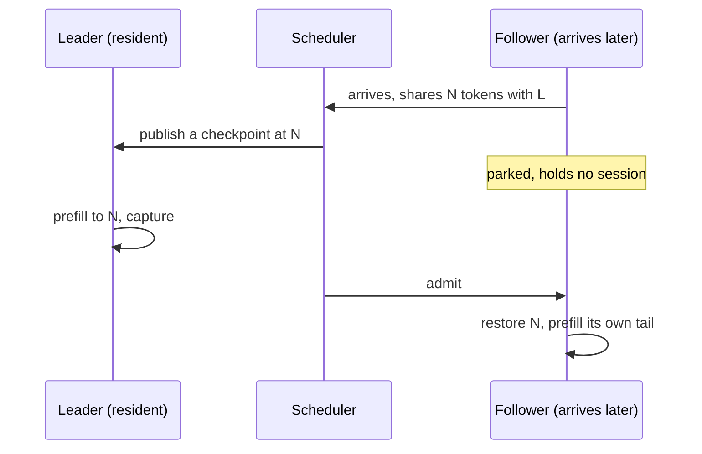

# KV Cache

## What "KV cache" means here

Two different things share the name. Keeping them apart avoids most of the
confusion.

**Within one request.** The standard transformer mechanism. Prefill computes
key and value tensors for every prompt token once; decode then appends one K/V
pair per generated token and attends over the stored set. Without it, each new
token would re-run attention across the whole sequence. This is intrinsic to
inference and is not configurable.

**Across requests.** Keeping that state alive after a response finishes, so
the next turn of the same conversation does not recompute the prefix it shares
with the previous one. This is what the rest of this document is about: the
`ContinuationCache`, and the optional on-disk tier behind `--cache-disk`.

The second is where the important subtlety lives. What Gufo retains is **not**
literally K/V tensors. It is an opaque snapshot owned by the model runner. For
Qwen3.8-27B that payload happens to be attention KV. For Qwen3.8-Flash-Next it
also contains GDN recurrent state, the indexer, position and sampling state.
The cache cannot inspect or interpret those bytes.

That choice buys one retention, admission, eviction and persistence mechanism
that is correct for every model, including hybrid-recurrent ones. It costs the
ability to trim a checkpoint: a saved snapshot can only be reused **whole**,
and only when its tokens are an exact prefix of the new prompt.

## Why it exists

Prefill cost scales with prompt length. Decode cost scales with tokens
generated. Agent conversations have a large prompt and a small output, and
turn *N*'s prompt is nearly all of turn *N−1*'s prompt. Without cross-request
reuse, every turn pays for the whole conversation again and total cost grows
quadratically with conversation length.

What reuse is worth, same conversation, second turn against a cold start
**(measured)**:

| Model | Prompt | Cold | Reused |
| --- | ---: | ---: | ---: |
| Qwen3.8-27B | 101,545 | 280.4 s | 2.4 s |
| Qwen3.8-Flash-Next | 203,047 | 184.4 s | 0.7 s |

A recorded 28-turn `pi` coding session reused 95.9% of its prompt tokens. The
same session replayed with reuse broken reprocessed 9.3x the tokens and took
2.5x the wall time, at only 15k tokens **(measured)**.

## The shape of the system



The in-memory tier is always on. The disk tier is opt-in, adds restart safety,
and can additionally *learn* boundaries between conversations that merely share
a prefix.

## Finding reuse

A request arrives with a token sequence. The cache looks for the longest
retained prefix of it, in two different forms.



A **live frontier** is where a session's state actually ended up after its last
request, including the tokens it generated. It is preferred even when a
snapshot matches the same length, because the state is already sitting there:
no restore and no device copy. This is why continuing the previous turn of a
conversation is nearly free, and why reuse can cover generated tokens and not
just prompt tokens.

A **snapshot** is an immutable retained checkpoint. Reusing one means restoring
it into a session, which costs a copy.

Both require an **exact prefix match**. The cache still computes the longest
common prefix on a miss and reports it, which is why a miss can say "we agreed
on 7,094 of your 7,103 tokens" and still re-prefill everything: it had no
checkpoint at that position to resume from.

### Worked example

A conversation with a 5,000-token system prompt, thinking off, client replaying
the assistant turn verbatim:

| Turn | Prompt | Reused | Prefilled | Why |
| --- | ---: | ---: | ---: | --- |
| 1 | 5,020 | 0 | 5,020 | nothing retained yet |
| 2 | 5,320 | 5,020 | 300 | live frontier from turn 1 |
| 3 | 5,620 | 5,320 | 300 | live frontier from turn 2 |

Now change one thing: edit the *last user message* of turn 3 and resend. The
first 5,320 tokens are byte-identical. The longest usable retained checkpoint
wins, which can be the previous turn's frontier. If the longest usable
checkpoint is instead the intermediate position at 4,096 tokens, that prefix
can be restored and only the suffix is prefilled. If earlier checkpoints have
been evicted or refused by the byte budget,
and all remaining checkpoints fall after the edit, reuse is impossible:

| Turn | Prompt | Reused | Prefilled | Common prefix |
| --- | ---: | ---: | ---: | ---: |
| 3', intermediate checkpoint retained | 5,620 | 4,096 | 1,524 | 5,599 |
| 3', no usable earlier checkpoint | 5,620 | 0 | 5,620 | 5,599 |

That gap between "common prefix" and "reused" is the signature of the
exact-prefix limitation. See #331.

## Concurrent requests sharing a prefix

Checkpoints help a request only once they exist. When several requests that
share a prefix arrive together, such as subagents started from one system
prompt or a retry sent before the first attempt returns, none of them finds a
checkpoint, and each would prefill the shared tokens again. Prefill runs one
request at a time, so the copies cost the sum of all prefills, and all
requests finish together at the end.

Instead, a cold request that shares a long prefix with a request already
prefilling it waits for that one:



1. On admission, the scheduler compares the new prompt with every resident
   request still prefilling and takes the longest exact token prefix with
   matching input identity.
2. It waits only when the shared prefix is at least 512 tokens longer than
   what the request could already restore, the resident request has not yet
   prefilled past that point, and the runner supports snapshots. A
   conversation continuing from its own retained turn therefore never waits
   for a newcomer that shares only its system prompt.
3. The resident request stops its prefill at the shared position and
   publishes a RAM checkpoint there, as for intermediate checkpoints. A
   checkpoint it already plans within 64 tokens is used instead. Identical
   prompts share up to the leader's last prompt token or its stable boundary.
4. The waiting request holds no session. Once the checkpoint is retained, or
   the leader passes the position, finishes or is cancelled, it is admitted
   ahead of newer requests and acquires its cache as usual.

Because requests are waiting for it, that checkpoint is retained with the
priority of a conversation's stable boundary: on a full cache it replaces the
least recently used checkpoint rather than being refused as an optional copy.
Waiting is still advisory, like admission: if the checkpoint does not fit at
all or the leader is cancelled, the request prefills by itself. A request
waits at most once, and at most `--sessions - 1` requests wait at a time. With
`--sessions 1` nothing waits, because a second request is never admitted
while the first prefills.

Measured on Flash-Next with `--sessions 4` and a 3.8k-token shared system
prompt, four concurrent requests took 13.4 s with each prefilling 3.9k tokens.
Prefilling the shared prefix once and restoring it took 4.6 s, each request
then prefilling 115 tokens **(measured)**. With a 242-token shared prefix the
gain was about 1 s of 9 s, which is why short prefixes do not wait.

## What gets retained

The unit of retention is a **checkpoint**, not a conversation. A single request
can retain up to four intermediate checkpoints in addition to its branching
fallback and complete prompt. Prefill stops at those positions and captures the
whole model state before advancing. Positions lie on a 2,048-token grid spread
across the prompt; the final grid point is within 2,048 tokens of its end.
Warm continuations skip grid positions less than 2,048 tokens beyond the reused
frontier, and every request skips grid positions within 128 tokens of its end:
such a point would split the final prefill pass for a checkpoint next to the
complete prompt. Capture runs asynchronously while that session is frozen, so other
requests can continue; a single execution slot skips the extra worker. A
request whose first token is already published decodes as soon as its capture
finishes, before the next bounded prefill chunk of a peer.
Coincident RAM and disk boundaries share one copy. Admission
remains subject to the existing byte budget, and intermediate copies preserve
the original branching fallback. These intermediate checkpoints live in RAM;
the disk tier continues to retain prompt and learned shared-prefix boundaries.

### Learned divergence points

Grid checkpoints sit at fixed positions, not where conversations actually
diverge. Agents start many conversations with the same system prompt and tool
definitions, then a different task:

```text
Conversation 1:  [ shared 4,500 tokens ][ task A, 10,000 tokens ]
grid checkpoints:       ^2,048    ^6,144    ^10,240    ^14,336
```

Only the 2,048 checkpoint lies inside the shared part, so a second
conversation would restore 2,048 tokens and prefill the other 2,450 shared
tokens again. The longer the tasks, the further the grid spreads.

The point that matters, token 4,500, is unknown until a second prompt shows
where the two differ. When a request arrives, the cache compares it with the
tokens of every retained checkpoint and live frontier of the same input
identity. If the longest common prefix adds at least 512 tokens to what the
request can already restore, the request stops its prefill there and retains
an extra checkpoint. Other conversations depend on it, so it is retained like a
stable boundary, not as an optional copy, and the branch-point rule below keeps
it while it is shared. From the third conversation on, every new one restores
the whole shared prefix and prefills only its own task. A divergence within
the request's last 64 tokens, such as an edited final message, is covered by
its own stable checkpoint and takes no extra copy. The same position from the same prefix family is captured
once; records whose images differ from the prompt are not used to find it.
Without disk, this needs no configuration.

Execution and retention have separate limits. `--sessions N` allocates N
mutable execution states and controls active request concurrency. A separate
pool holds **128 immutable checkpoint records**, regardless of session count.
These records allocate no extra execution states: with `--sessions 1`, several
inactive conversations can still be remembered.

This is a checkpoint limit, not a guaranteed conversation count. One history
can occupy several records, and the byte budget may bind before all 128 are
used. The server identifies related checkpoints by exact token prefixes and
matching input identities, not a client-supplied conversation ID.

When space is needed, RAM retention prefers removing:

1. A full-prompt retry copy with a stable fallback still retained.
2. An intermediate copy with a related stable continuation retained.
3. An older stable boundary covered by a newer one. A checkpoint that two
   retained conversations extend and then diverge after is the prefix they
   share, not an older turn, and never counts as covered.
4. Remaining checkpoints, oldest-used first within each priority.

Under entry pressure, an edited branch can first replace its incompatible
tail, preserving earlier shared checkpoints. Optional history/retry copies
are skipped rather than removing another prefix family's last useful copy.
Retry copies cannot displace earlier history or stable boundaries either.
An unchanged retry then restores the stable boundary and prefills only the
assistant opening, such as `<|im_start|>assistant\n<think>\n`, again; the
server logs `event=snapshot action=skipped` with that prompt's length.
A new stable boundary can replace its own older boundary when that avoids
removing another family's last copy. Sources are rechecked before replacement
because another request may have changed the record.

The original resume point stays protected during intermediate/retry admission.
Earlier checkpoints remain best-effort: under pressure, edits and rewind may
need more prefill. Rotation beyond the actual memory or record capacity can
still lose reuse; this is not unlimited retention.

The actual selected limits are reported at startup:

```text
event=snapshot_cache_configured sessions=1 snapshot_entries=128 capacity_bytes=8589934592 automatic_bytes=8589934592 max_bytes=13958643712
```

## Invariants

These constraints are why several design choices are not preferences. Change
them deliberately or not at all.

**A checkpoint must contain the state at its exact token boundary.** Most
runners stop prefill at that boundary before capturing it. Flash-Next can
capture a text prompt's stable boundary within the final prefill pass: its
recurrent kernels retain the boundary state, convolution and PLE retain their
history, and a one-row head computes the boundary logits. Attention queries
on either side keep the grouping of separate passes. The final batch can
include up to 128 tokens beyond the normal 2,048-token chunk, so a prompt that
ends just past a chunk needs no separate tail pass; the stable boundary must be
within eight tokens of that batch's end.
The cache reserves the full payload before enabling this capture. Disk,
image, intermediate and learned-prefix checkpoints still stop prefill at
their boundary.

**The reused frontier must be frozen before prefill.** Prefill mutates the
leased state in place, so a frontier another request might branch from has to
be captured first.

Flash-Next copies its mutable recurrent, convolution and PLE state into
private device storage at capture; the small indexer-ring, draft-residual and
kept-row regions go directly into the host payload. Committed K/V and pooled
rows remain in the live session while it appends, without a K/V copy.
A same-session rewind allocates backing blocks for only the rows it would
overwrite and copies them once for checkpoints sharing those rows. Appending
allocates no K/V backing blocks. Restore keeps the still-live prefix without
a K/V upload.
Reset leaves append-only rows intact; the first write that would overwrite
them preserves pending checkpoints. Session destruction preserves remaining
rows before releasing device buffers. Byte readers assemble a complete
payload before export. Forks copy the live prefix directly between device
buffers, including detached rows in the shared backing blocks. When both
sessions branch from a shared checkpoint, restore retains their proven shared
rows and copies only the different suffix. Equal token histories alone do not
prove identical K/V, since prefill shapes can change rounding.
A private HIP pool shared by the executor's sessions allocates and releases
snapshot storage without synchronizing peer inference streams. Each fresh
allocation commits device pages, about 4.5 ms per 111 MB on gfx1151, so a
restore into a slot whose rows other checkpoints still borrow pays that cost
for the rows it protects. A retained
Flash-Next snapshot prefers its source execution slot when
that slot is available, avoiding a full-prefix copy for a rewritten turn.
A busy source never blocks a branch into another slot; other choices use LRU.
RAM admission continues to charge the complete payload size, and the disk
byte format is unchanged. Captures intended for disk complete all device
copies before prefill resumes, so disk serialization does not introduce a
background K/V transfer during inference.

**Admission is advisory, never fatal.** A refused reservation or a failed
capture is a skipped optimisation. The request must still complete.

**Eviction cannot skip a victim.** If removing an entry fails, the eviction
loop stops rather than trying the next candidate, in both tiers **(source)**.

## Limits

Independent limits can each bind first. Payload memory is allocated only when
captured; RAM-retained snapshots and their captures in progress share the RAM budget.

| Limit | Default | Set by |
| --- | --- | --- |
| Retained snapshot bytes, RAM | smaller of 32 GiB and half the available host RAM; an explicit value up to the available host RAM minus 4 GiB; 27B also checks HIP free memory | `--cache-ram-bytes` |
| RAM checkpoint records | 128, independent of `--sessions` | internal safety limit |
| Disk bytes | 8 GiB | `--cache-disk-bytes` |
| Disk staging bytes | smaller of `MemAvailable / 8` and the disk budget | `--cache-disk-staging-bytes` |

`--cache-ram-bytes 0` selects automatic sizing. Zero does not disable reuse.
A positive value replaces the automatic budget and may exceed it: it trades the
free half of host RAM for retention, but always leaves 4 GiB to the OS and other
processes. For an 8 GiB cap, use `--cache-ram-bytes 8589934592`. The startup
line reports the selected `capacity_bytes`, the `automatic_bytes` budget and
the `max_bytes` an explicit value may claim.

Both are sampled after weights and execution states are allocated, then fixed
for the server run. Flash-Next and Qwen3.8-27B use half the available
host RAM, respecting container/cgroup limits. 27B also clamps this to HIP's free
device memory. CPU and GPU allocations compete for the same physical RAM on
Strix Halo, so HIP's free-memory estimate alone is not enough.
For example, 44 GiB available at load gives a 22 GiB automatic RAM cache and
allows an explicit limit of up to 40 GiB, even when HIP reports more free
memory.
The RAM payload budget excludes weights, execution states, token metadata
and disk staging. It also excludes temporary host buffers used to save
checkpoints to disk; this is not a limit on total server memory.

Qwen checkpoints of one history share attention KV. A checkpoint stores KV in
blocks of 2,048 positions. A checkpoint captured from a state that was restored
from, or already saved as, another checkpoint holds the same full blocks rather
than copying them; only the positions past the last full block and the
recurrent state are its own. A shared block counts once against the budget and
is freed with the last checkpoint that holds it. `bytes=` in the log is still
the complete payload of one checkpoint, so `retained_bytes` can be smaller than
the sum over retained checkpoints. Rewinding or resetting a session ends
sharing from that position on. Disk entries are always complete copies.

The budget is an estimate made at load; device memory can shrink afterwards.
When a Qwen checkpoint the budget admitted cannot be allocated, the budget
drops to the bytes already retained and in flight (never below that one
checkpoint), retained checkpoints give way in the usual eviction order, and
the capture is attempted once more. The budget does not grow back during the
run.

The 32 GiB automatic cap limits default growth on a lightly loaded machine.
It leaves room for several 27B histories: two 3.7 GB checkpoints per history
would consume about 30 GB for four conversations, before optional copies.
The 128-record safety limit bounds metadata and lookup work without requiring
more execution sessions. Neither guarantees a conversation count: roughly,
divide the byte budget by the retained checkpoint bytes per conversation.
For example, 8 GiB holds at most eight sets of two 512 MiB checkpoints, or
two sets of two 2 GiB checkpoints, before extra copies and in-flight captures.

Increasing context or sessions reduces the memory left after loading, and
with it both budgets, exactly when snapshots grow. On Flash-Next with
`--sessions 2` at 262144 context, 14.8 GB remained after loading: a 7.76 GB
automatic budget against 5.70 GB snapshots at 200k tokens, so only one deep
conversation stays retained **(measured)**. A newer conversation's stable
boundary then replaces the older one's checkpoint; only optional intermediate
and retry copies are refused. This is a hardware ratio, not a cache policy:
weights, execution states and the OS leave no more memory. To keep more deep
conversations:

- Raise `--cache-ram-bytes` towards the reported `max_bytes`: about 10.5 GB
  here, enough for a 200k-token checkpoint plus a 50k one instead of only the
  first.
- Run fewer `--sessions`: each Flash-Next session at 262144 context holds about
  6.3 GB of state that the cache can use instead.
- Add `--cache-disk` with `--cache-disk-staging-bytes` above the snapshot size,
  so checkpoints that leave RAM can still be restored from disk.

See #343.

Snapshot size scales with retained tokens and differs sharply between models:
roughly 0.5 GB at 5k tokens on Flash-Next, and 3.7 GB at 24k tokens on
Qwen3.8-27B **(measured)**. Automatic disk staging therefore has no fixed cap:
it follows available RAM and the disk budget, so `--cache-disk` keeps 27B
checkpoints at moderate depth without an explicit limit. See #259.

RAM eviction follows the checkpoint priorities above. Disk eviction remains
global least-recently-used, without conversation or rebuild-cost awareness.

## The disk tier

`--cache-disk DIR` adds a second tier that survives restarts. A checkpoint
written before a restart restored a 24,866-token prompt in 1.8 s against about
50 s for a cold prefill **(measured)**.

It also **learns shared-prefix boundaries** that survive restarts. RAM learns a
divergence point from the second conversation and restores it from the third
(see above); the disk index needs more conversations, and in one run its
boundary became usable from the fifth **(measured)**. When both tiers choose the
same position, one capture feeds both. See #267.

**Disk checkpoints are spaced at least 2048 tokens apart.** A conversation
advances a few hundred tokens per turn, so writing every turn serialises, fsyncs
and retains a nearly identical snapshot. A checkpoint less than 2048 tokens past
the longest stored entry that is still a prefix of it is skipped and logged as
`min_step`; the RAM tier still retains it. When RAM does not retain it either,
the device state is not copied at all, so a skipped checkpoint costs no capture
time on the request path. Learned shared-prefix boundaries are
exempt, because they sit close to a deeper entry by construction. On a
Qwen3.8-27B functional run this cut disk writes from 31 to 5 and written bytes
from 6.97 GiB to 1.37 GiB **(measured)**.

The trade-off is what a disk-only restore resumes from. After a restart, or
once RAM evicted the conversation, a request restores the nearest stored entry
and re-prefills up to 2048 tokens plus its own turn, instead of resuming
exactly at the previous frontier. Greedy output is unchanged. Sampled output can
differ from the pre-restart response, because the re-prefilled gap follows
different chunk shapes, as with any partial hit. Plain continuation from RAM is
unaffected.

Disk entries are evicted by global LRU on last access, so one active run whose
checkpoints are all recent will displace every other conversation in age order
**(measured)**. See #275.

## What invalidates reuse

Anything that changes the token prefix. In practice:

- **Tool definitions** — adding, removing or reordering changes the prompt head
  and invalidates everything after it.
- **System prompt** — including anything volatile inside it, such as a
  timestamp or a working directory.
- **Response schema** — `response_format` is rendered into the prompt.
- **Images** — changing, removing or moving an earlier image invalidates
  checkpoints after it. Appending a new one does not.
- **Reasoning the client cannot replay** — thinking is on by default for Qwen
  and `reasoning_content` is not part of the OpenAI schema, so an ordinary
  client omits it when sending the conversation back. Gufo retains each turn's
  boundary before the assistant opening, so the next turn can reuse the prior
  history and process the rewritten assistant plus new input. That boundary
  must be saved on warm hits too; retaining only the old resume point caused
  cache reuse to stop advancing for the rest of the session. See #335.

These do **not** invalidate reuse **(measured)**: changing `temperature`,
`top_p`, `seed`, `max_tokens`, penalties or `stop` between turns; streaming
versus not, which reuse identically and interoperate within one conversation.

`cache_prompt: false` bypasses lookup for a single request. The result can
still populate the cache.

## Observing it

| Log line | Meaning |
| --- | --- |
| `event=snapshot_cache_configured` | retained capacity at startup, with the automatic budget and the most an explicit `--cache-ram-bytes` may claim |
| `event=snapshot action=removed reason=entry_capacity` | a retained prefix was evicted because every entry was taken |
| `event=snapshot action=skipped reason=entry_capacity` | no checkpoint record could be replaced safely for this capture |
| `event=snapshot action=skipped reason=byte_capacity` | a checkpoint did not fit the RAM budget |
| `event=snapshot_capacity_lowered reason=allocation_failure` | the device could not hold a checkpoint the RAM budget admitted; the budget dropped to what is retained |
| `event=snapshot action=skipped reason=capture_failure` | a checkpoint could not be captured, including after that retry |
| `event=disk_cache action=removed reason=lru` | a disk entry was evicted to stay inside `--cache-disk-bytes` |
| `event=disk_cache action=skipped reason=staging_capacity` | a checkpoint exceeded `--cache-disk-staging-bytes` and was never written |
| `event=disk_cache action=skipped reason=min_step` | a checkpoint was less than 2048 tokens past a stored prefix; RAM still retains it |

Per-request outcomes appear in the completion log and in `usage.gufo`:
`cache_hit`, `cache_miss_reason`, `cache_common_prefix_tokens`,
`cache_checkpoint_tokens`, `cache_restore_bytes`, `cache_restore_ms`,
`shared_prefix_wait_ms` (time spent waiting for a concurrent request, part of
`queue_ms`), plus
`prompt_n` (newly processed) and `cache_n` (reused) in the llama.cpp-compatible
`timings` object. Miss reasons are `no_checkpoint`, `prefix_changed`,
`input_changed` and `disabled`.

Reading them:

- `cache_n` growing turn over turn while `prompt_n` stays flat is healthy
  reuse.
- Concurrent requests with a shared prefix: one has `shared_prefix_wait_ms`
  zero and prefills the prefix; the others wait, then report the prefix in
  `cache_n` and only their own tail in `prompt_n`. With `--log-level debug`,
  `event=shared_prefix_wait` and `event=shared_prefix_ready` name the leader
  and position.
- `cache_n` **pinned** at the same value while `prompt_n` grows every turn is a
  checkpoint that stopped advancing. See #335.
- A large `cache_common_prefix_tokens` on a miss means a long prefix agreed and
  could not be resumed from: a mid-history edit, or an evicted checkpoint.

## Verifying changes

- `tests/functional/` covers rotation through independent conversations, a long
  history interrupted by tiny side requests, edits/rewind, advancing boundaries,
  cancellation and disk restart. Uncached controls check the answers; CPU tests
  exercise byte and record pressure without loading models.
- `tests/functional/continuation.py` covers cancellation, reasoning replay,
  images and restart persistence against a live server. After a restart,
  greedy and exact restores must reproduce their output; sampled restores may
  re-prefill less than one disk step.
- `tests/functional/cache_disk_spacing.py`, part of the `cache` suite, checks
  disk checkpoint spacing for a growing conversation, the restore after
  restart, and that a learned branch boundary is still written.
- `tests/functional/cache_concurrency.py` (`cache-concurrency`) sends
  identical prompts, shared-system fan-out with short and long tasks, short or
  no shared prefixes, a retained conversation beside a newcomer and a
  cancelled leader at once, checking waits, prefill work and uncached answers.
  `tests/cli/text_generation_scheduler_test.cpp` covers the same cases, plus
  runners without snapshots, without loading a model.
- `tests/cli/continuation_cache_test.cpp`,
  `tests/cli/continuation_disk_store_test.cpp` and
  `tests/cli/text_model_runner_test.cpp` cover retention, admission, eviction
  and the event sinks without loading a model.

## Known gaps

Tracked under #336, with the upstream reports #331, #335, #259, #267, #275,
#300 and #318.
