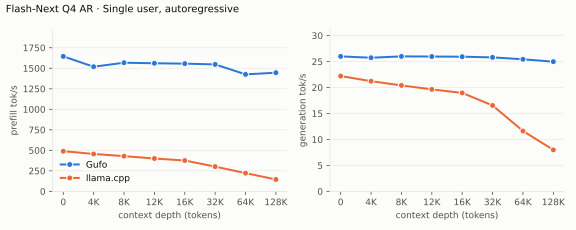
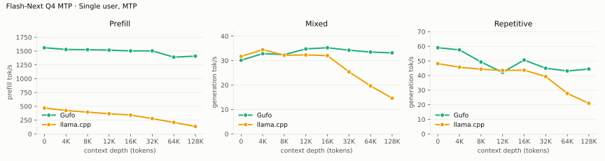

# Qwen3.8 Flash-Next benchmarks

AMD Strix Halo `gfx1151`, 128 GB unified memory. Unsloth `UD-Q4_K_XL` target and
shared-Q8_0 MTP sidecar; Gufo uses adaptive MTP. HTTP, greedy, thinking off.
Gufo single-user pp/tg: October 7, 2026 (`def2ed1e`), Performance power profile.
Concurrency, loading, memory and reference results: September 22–23.
llama.cpp uses `b11069` for AR and `6fcaa16f` for MTP.

Positive gain favors Gufo.
[Quality and measurement details](QUALITY.md#benchmark-method) · [Model identities](artifacts/model-identities.json)

## Single user, autoregressive

Approximately pp2048 / tg128; depth is the cached prefix in tokens.
Context capacities differ between engines; see the measurement details.

<!-- bench:single-ar -->
| Flash-Next Q4 AR Depth (tokens) | Gufo pp (tok/s) | llama.cpp pp (tok/s) | Gain | Gufo tg (tok/s) | llama.cpp tg (tok/s) | Gain |
| ---: | ---: | ---: | ---: | ---: | ---: | ---: |
| 0 | 1644.68 | 489.59 | +235.9% | 25.99 | 22.20 | +17.1% |
| 4,096 | 1518.57 | 455.24 | +233.6% | 25.73 | 21.21 | +21.3% |
| 8,192 | 1567.32 | 428.85 | +265.5% | 25.99 | 20.40 | +27.4% |
| 12,288 | 1560.97 | 400.21 | +290.0% | 25.96 | 19.64 | +32.2% |
| 16,384 | 1556.02 | 375.89 | +314.0% | 25.93 | 18.95 | +36.8% |
| 32,768 | 1546.81 | 301.31 | +413.4% | 25.80 | 16.54 | +56.0% |
| 65,536 | 1425.49 | 221.94 | +542.3% | 25.43 | 11.62 | +118.8% |
| 131,072 | 1446.10 | 144.78 | +898.8% | 24.97 | 7.98 | +212.9% |
<!-- /bench -->

## Single user, MTP

pp is the highest measured rate per engine and depth across mixed/repetitive
text, including Gufo predictor catch-up.

<!-- bench:single-mtp -->
| Flash-Next Q4 MTP Depth (tokens) | Gufo pp (tok/s) | llama.cpp pp (tok/s) | Gain pp | Gufo tg mixed (tok/s) | llama.cpp tg mixed (tok/s) | Gain mixed | Gufo tg repetitive (tok/s) | llama.cpp tg repetitive (tok/s) | Gain repetitive |
| ---: | ---: | ---: | ---: | ---: | ---: | ---: | ---: | ---: | ---: |
| 0 | 1560.11 | 468.76 | +232.8% | 30.16 | 31.73 | -4.9% | 59.02 | 48.12 | +22.7% |
| 4,096 | 1529.17 | 423.79 | +260.8% | 32.86 | 34.48 | -4.7% | 57.58 | 45.71 | +26.0% |
| 8,192 | 1525.11 | 394.98 | +286.1% | 32.47 | 32.20 | +0.8% | 49.26 | 44.31 | +11.2% |
| 12,288 | 1517.04 | 365.91 | +314.6% | 34.78 | 32.32 | +7.6% | 42.19 | 43.53 | -3.1% |
| 16,384 | 1502.95 | 341.98 | +339.5% | 35.27 | 32.07 | +10.0% | 50.60 | 43.66 | +15.9% |
| 32,768 | 1503.08 | 277.61 | +441.4% | 34.27 | 25.41 | +34.9% | 44.98 | 39.28 | +14.5% |
| 65,536 | 1390.03 | 208.04 | +568.2% | 33.51 | 19.65 | +70.5% | 43.12 | 27.75 | +55.4% |
| 131,072 | 1408.06 | 135.42 | +939.8% | 33.18 | 14.63 | +126.8% | 44.43 | 20.96 | +112.0% |
<!-- /bench -->

## Multiple users, autoregressive

Same pp2048 prose prompt as single-user d0, tg128, context 4096 per user.
All sessions prefilled before timed decoding; throughput sums individual rates.
llama.cpp re-evaluates its four-token checkpoint tail.

<!-- bench:multi-ar -->
| Flash-Next Q4 AR Users | Gufo AR (tok/s) | llama.cpp AR (tok/s) | Gain |
| ---: | ---: | ---: | ---: |
| 1 | 25.85 | 22.34 | +15.7% |
| 2 | 45.70 | 37.08 | +23.2% |
| 4 | 76.29 | 54.82 | +39.2% |
| 6 | 95.66 | 65.34 | +46.4% |
| 8 | 108.67 | 68.79 | +58.0% |
<!-- /bench -->

## Multiple users, MTP

Same pp2048 mixed/repetitive prompts as single-user d0, tg128, context 4096
per user. All sessions prefilled before timed decoding; rates sum individual
request decode rates. C1 cross-checks the single-user table.

<!-- bench:multi-mtp -->
| Flash-Next Q4 MTP Users | Gufo mixed (tok/s) | llama.cpp mixed (tok/s) | Gain | Gufo repetitive (tok/s) | llama.cpp repetitive (tok/s) | Gain |
| ---: | ---: | ---: | ---: | ---: | ---: | ---: |
| 1 | 32.09 | 31.77 | +1.0% | 59.20 | 46.93 | +26.1% |
| 2 | 51.68 | 42.79 | +20.8% | 93.16 | 52.57 | +77.2% |
| 4 | 75.92 | 48.78 | +55.6% | 127.91 | 48.23 | +165.2% |
| 6 | 89.18 | 52.59 | +69.6% | 142.14 | 48.51 | +193.0% |
| 8 | 106.47 | 61.92 | +71.9% | 157.22 | 58.13 | +170.5% |
<!-- /bench -->

## Loading time

C1, context capacity 262144, MTP. Cold target/sidecar files to HTTP readiness.

<!-- bench:loading -->
| Flash-Next Q4 Target | Gufo ready (s) | llama.cpp ready (s) | Gain |
| --- | ---: | ---: | ---: |
| Q4 | 15.45 | 117.83 | +662.7% |
<!-- /bench -->

## Memory occupation

C1, context capacity 133121, AR. Peak memory reported by HIP.

<!-- bench:memory -->
| Flash-Next Q4 AR Workload | Gufo GiB | llama.cpp GiB | Gain |
| --- | ---: | ---: | ---: |
| pp2048 + tg128 | 85.55 | 84.84 | -0.8% |
| 16K prefix, pp4096 + tg128 | 86.27 | 85.31 | -1.1% |
<!-- /bench -->

